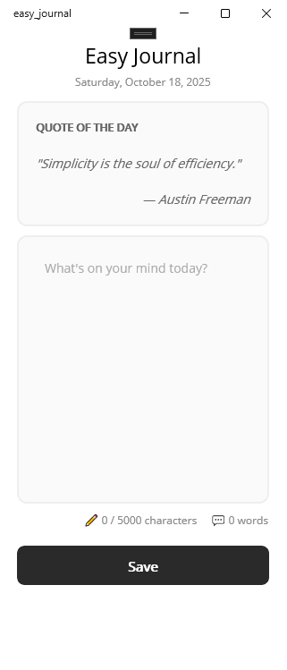
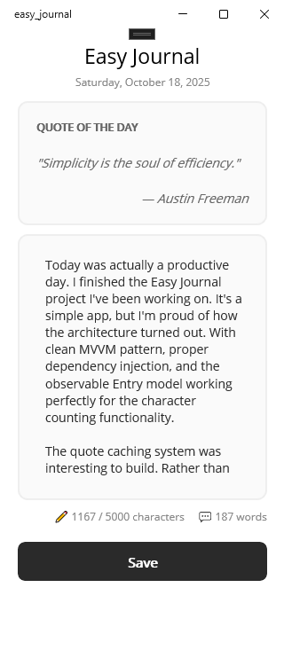

# Easy Journal 📔

A minimalist daily journaling app built with .NET MAUI.


## Screenshots

<table>
  <tr>
    <td></td>
    <td></td>
  </tr>
</table>

## Features

- Daily inspirational quotes with caching
- One journal entry per day
- Real-time word and character counting
- Offline-first SQLite storage
- Clean MVVM architecture

## Tech Stack

- .NET MAUI 9.0
- SQLite for local persistence
- REST API integration (Quotable.io)

## Architecture Highlights

- **Observable Entry Model** - Computed properties for real-time word/character counts
- **Thread-Safe Database Init** - Lazy initialization with SemaphoreSlim
- **Smart Caching** - One API call per day for quotes
- **Separation of Concerns** - Domain models separate from database models

## Running the Project
```bash
git clone https://github.com/conor-codes/easy-journal
cd easy-journal
dotnet restore
dotnet build
dotnet run --framework net9.0-windows10.0.19041.0
```

## Platform Notes

Tested on Windows 10/11. Built with cross-platform APIs and should work on Android/iOS/macOS.

## Future Plans

- Streak tracking
- Mood logging
- Entry history view

## License

MIT

---

**Portfolio project demonstrating .NET MAUI development and clean architecture.**

**Author:**  [Conor.Codes](https://conor.codes) 
